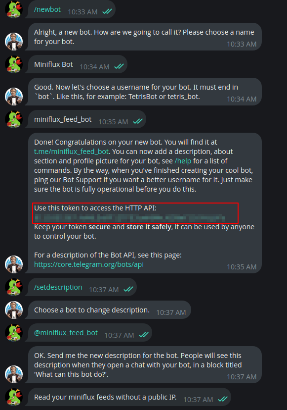

# miniflux-telegram-bot
A simple telegram bot to read your miniflux starred feeds without public IP.
## Setup
1. Create a bot with [BotFather](https://t.me/botfather)

Remember the token
2. Update `.env` file with your token
Format:
```
TG_TOKEN=
MINIFLUX_URL=
MINIFLUX_TOKEN=
TG_USERNAME= # optional, if you want to restrict access to the bot
```
